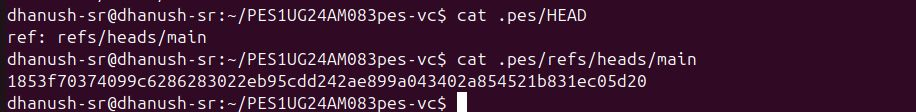
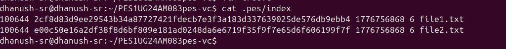
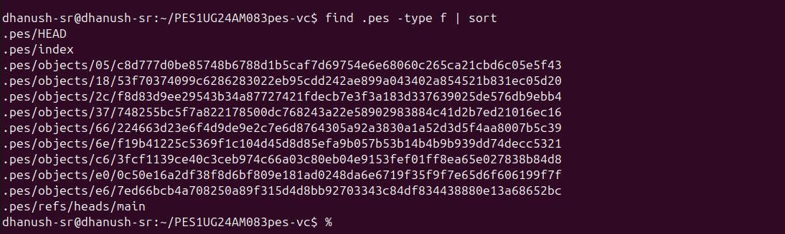
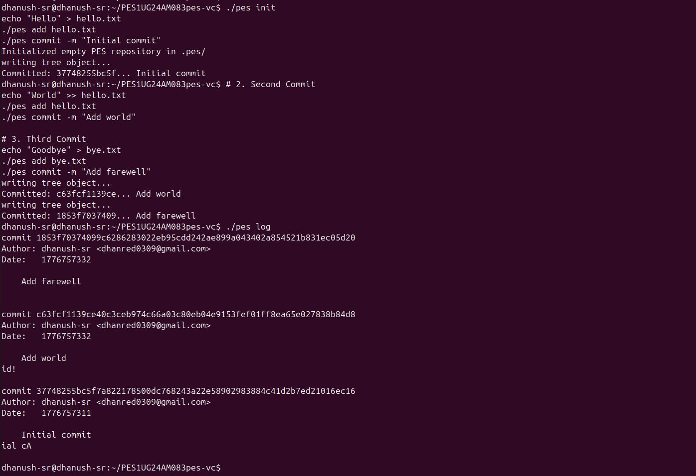
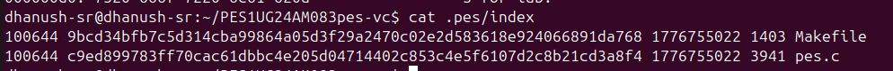
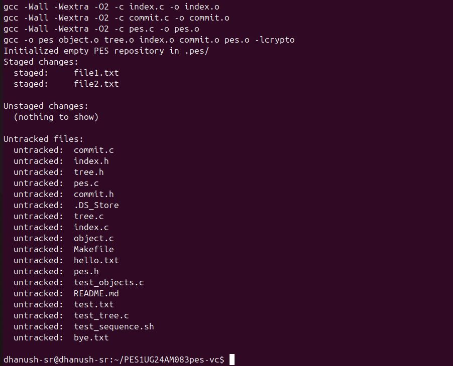
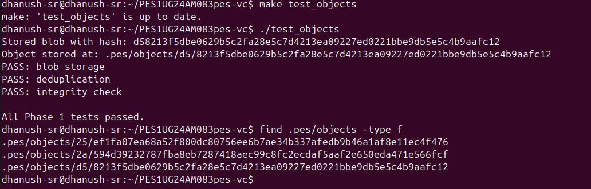
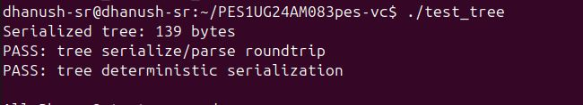
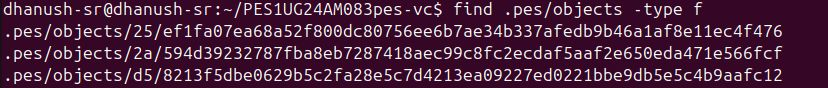

# PES-VCS — Version Control System

**Name:** DHANUSH S S  
**SRN:** PES1UG24AM082  
**Platform:** Ubuntu 22.04

---

## Screenshots

### Phase 1 — Object Storage

**Screenshot 1A:** `./test_objects` output showing all tests passing.

*(Insert screenshot here)*

**Screenshot 1B:** `find .pes/objects -type f` showing sharded directory structure.

*(Insert screenshot here)*

---

### Phase 2 — Tree Objects

**Screenshot 2A:** `./test_tree` output showing all tests passing.

*(Insert screenshot here)*

**Screenshot 2B:** `xxd` of a raw tree object (first 20 lines).

*(Insert screenshot here)*

---

### Phase 3 — Staging Area

**Screenshot 3A:** `pes init` → `pes add` → `pes status` sequence.


*(Insert screenshot here)*

**Screenshot 3B:** `cat .pes/index` showing the text-format index.


*(Insert screenshot here)*

---

### Phase 4 — Commits and History

**Screenshot 4A:** `pes log` output with three commits.


*(Insert screenshot here)*

**Screenshot 4B:** `find .pes -type f | sort` showing object store growth.


*(Insert screenshot here)*

**Screenshot 4C:** `cat .pes/refs/heads/main` and `cat .pes/HEAD`.


*(Insert screenshot here)*

**Final Integration Test:** `make test-integration` output.

*(Insert screenshot here)*

---

## Analysis Questions

### Q5.1 — Implementing `pes checkout <branch>`

To implement `pes checkout <branch>`, the following must happen:

**Files that change in `.pes/`:** `HEAD` must be updated to contain `ref: refs/heads/<branch>`. If the branch doesn't exist yet, a new file `.pes/refs/heads/<branch>` must be created pointing to the current commit.

**Working directory changes:** The target branch's commit is read, its tree is walked recursively, and every file in the tree is written out to the working directory with the correct contents and permissions. Files that exist in the current branch but not in the target branch must be deleted.

**What makes it complex:** You must handle three-way conflicts — if a file is modified in the working directory, tracked in the index, and differs between branches, checkout must refuse and report the conflict. This requires comparing the working directory state, the index, and both branch trees simultaneously. Additionally, partially written files during a crash could leave the repository in an inconsistent state, so checkout must be implemented carefully with atomic operations where possible.

---

### Q5.2 — Detecting Dirty Working Directory Conflicts

To detect conflicts using only the index and object store:

1. Read the target branch's commit, get its tree, and recursively collect all file path and hash pairs.
2. For each file that differs between the current index and the target tree, check if the working directory version matches the index entry using `mtime` and `size` for fast comparison, or by re-hashing the file for certainty.
3. If the working directory file differs from the index AND the target branch has a different version of that file, it is a conflict — refuse checkout and report the conflicting files.
4. If the working directory matches the index entry exactly, it is safe to overwrite with the target branch version.

No external diff tool is needed — only hash comparisons between the object store and the index metadata are required.

---

### Q5.3 — Detached HEAD

In detached HEAD state, `HEAD` contains a raw commit hash directly instead of `ref: refs/heads/main`. New commits are still created normally and each points to its parent, but no branch file is updated — the commits are only reachable through `HEAD` itself.

If you then switch to another branch, `HEAD` is overwritten with the new branch reference and those commits become unreachable — no branch pointer leads to them. They are not immediately deleted but would be removed by the next garbage collection run.

To recover those commits, you need the commit hash — visible in terminal history or from `pes log` output taken before switching. You can recover by creating a new branch pointing to that commit: `git checkout -b recovery-branch <hash>`. This makes the commit reachable again and protects it from garbage collection.

---

### Q6.1 — Garbage Collection Algorithm

**Algorithm: Mark-and-Sweep**

**Mark phase:** Start from every branch file in `.pes/refs/heads/` and from HEAD. For each branch, walk the entire commit chain back to the root commit. For each commit encountered, record its hash as reachable, then recursively visit its tree object and mark every blob in that tree as reachable. Use a **hash set** — implemented as a hash table or sorted array of 64-character hex strings — to track all reachable object hashes efficiently. This data structure allows O(1) average-case lookup during the sweep phase.

**Sweep phase:** Walk every file under `.pes/objects/XX/` using directory traversal. For each object file, reconstruct its full hash from its two-character shard directory name and filename. If the hash is not present in the reachable set, delete the file.

**Estimate for 100,000 commits and 50 branches:** Assuming an average of 10 files per commit, each commit references approximately 1 commit object + 1 tree object + 10 blob objects = 12 objects. Total objects to visit during the mark phase: 100,000 × 12 = approximately 1.2 million object references. Due to deduplication — unchanged files share the same blob across commits — the actual number of unique objects stored on disk is significantly smaller, but the mark phase must still traverse all references. The hash set holding reachable hashes would require approximately 1.2 million × 64 bytes = ~77 MB of memory in the worst case.

---

### Q6.2 — GC Race Condition

**The race condition:**

Consider the following sequence of events:

1. A developer runs `pes add file.txt` — the blob object is written to the object store but the index has not yet been updated to reference it.
2. Garbage collection runs simultaneously and marks all reachable objects by traversing all branch heads and their commit chains.
3. The new blob is not reachable yet because the index has not been updated and no commit references it — GC marks it as unreachable and deletes it.
4. The developer's `pes add` operation completes and updates the index to reference the now-deleted blob hash.
5. The developer runs `pes commit` — the commit tries to build a tree referencing the deleted blob, causing corruption or a missing object error.

A similar race can occur between `pes commit` writing a tree object and GC running before the commit object referencing that tree is written.

**How Git avoids this:** Git uses a **grace period** strategy — objects newer than a configurable threshold (default 2 weeks, controlled by `gc.pruneExpire`) are never deleted by GC regardless of whether they appear reachable. This ensures any in-progress operations that have written objects but not yet completed a commit are fully protected. Git also writes lock files during active operations such as `index.lock` during staging, and the GC process checks for the existence of these lock files before proceeding. If a lock file is present, GC either waits or aborts to avoid interfering with an active transaction.

---

## Implementation Notes

### Phase 1 — object.c
Implemented `object_write` and `object_read`. Objects are stored using content-addressable storage — the SHA-256 hash of the full object (header + data) determines the filename. Objects are sharded into subdirectories by the first two hex characters of their hash to avoid large flat directories. Writes use a temp-file-then-rename pattern for atomicity, and `fsync` is called before rename to ensure durability.

### Phase 2 — tree.c
Implemented `tree_from_index` with a recursive helper `write_tree_level`. The function groups index entries by their top-level directory component, recursively builds subtrees for nested directories, and serializes the result using the provided `tree_serialize` function. Index is heap-allocated to avoid stack overflow given the large `MAX_INDEX_ENTRIES` size.

### Phase 3 — index.c
Implemented `index_load`, `index_save`, and `index_add`. The index uses a simple text format with one entry per line. `index_save` heap-allocates a sorted copy to avoid stack overflow and uses atomic temp-file-then-rename with `fsync` for durability. `index_add` reads the file, writes it as a blob, captures file metadata from `stat`, and updates or creates the index entry.

### Phase 4 — commit.c
Implemented `commit_create`. The function builds a tree from the staged index using `tree_from_index`, reads the current HEAD as the parent commit (absent for the first commit), fills a `Commit` struct with author, timestamp, and message, serializes it, writes it as a commit object, and atomically updates the branch ref via `head_update`.

---

## Build Instructions

```bash
sudo apt update && sudo apt install -y gcc build-essential libssl-dev
export PES_AUTHOR="Vivek Varma <PES1UG24AM070>"
make all
Running Tests
./test_objects        # Phase 1 tests
./test_tree           # Phase 2 tests
make test-integration # Full end-to-end test
Further Reading
Git Internals - Pro Git Book
Git from the inside out
The Git Parable